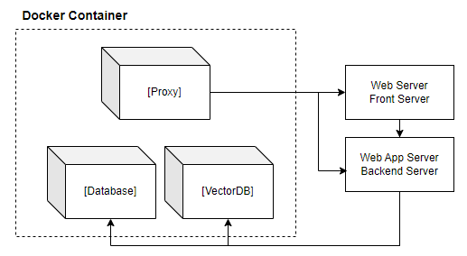
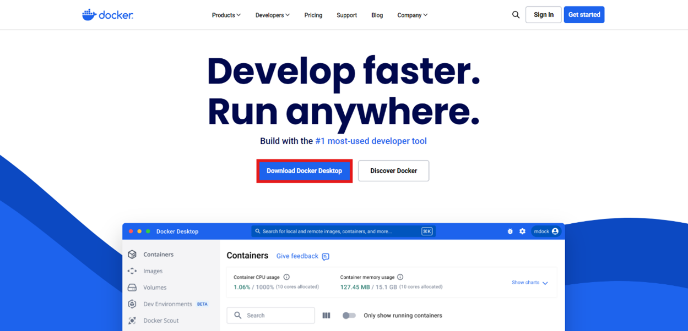
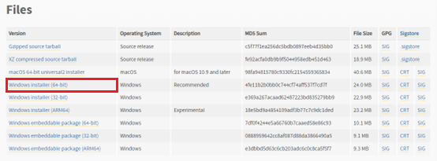
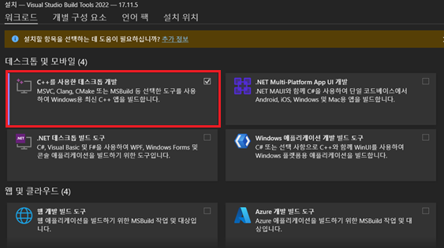
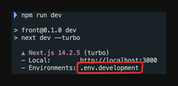
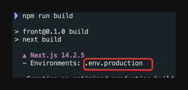

# 휴니버스 챗봇 시스템 설치 가이드 (Windows)

## 환경 구성 정보

| 구성                | 버전 정보      |
| ------------------- | -------------- |
| **OS**              | Windows 11     |
| **Server**          | Python 3.11    |
| **Web**             | Node.js 22     |
| **Database**        | MySQL 8.0      |
| **Vector Database** | ChromaDB 0.5.4 |
| **Proxy**           | Nginx 1.27     |

- 백엔드 서버와 프론트 서버는 로컬 파일을 실행하는 방식으로 운영됩니다. </br>
- 데이터베이스, 벡터DB, Proxy 서버는 도커 컨테이너를 빌드하는 방식으로 운영됩니다.

[//]: # ""

<div style="text-align: center;">
  
</div>

---

## 소스 다운로드

원하는 경로에 '소스 다운로드' 또는 'git clone'을 실행합니다.

```bash
C:\(원하는_경로)> git clone 'git_주소'
```

소스 다운로드 후 디렉토리 구조는 아래와 같습니다.

```
huniverse
├── server
└── web
```

---

## Docker 설치 및 컨테이너 설정

1. **Docker 설치** </br>
   다음 링크를 클릭하여 설치 페이지로 이동합니다.
   - [Docker 설치 링크](https://www.docker.com/products/docker-desktop)
   - [설치 가이드](https://dslyh01.tistory.com/39) </br>

[//]: # "   "

<div style="text-align: center;">
  
</div>

2. **MySQL, ChromaDB, Nginx 컨테이너 생성** </br>

   1. **huniverse/server** 폴더로 이동합니다.

      ```bash
      C:\(원하는 경로)> cd huniverse
      C:\(원하는 경로)\huniverse> cd server
      ```

   2. **huniverse/server** 폴더에서 아래의 커맨드를 실행합니다.

      ```bash
      C:\(원하는_경로)\huniverse\server> docker-compose up -d
      ```

   3. 컨테이너 생성 및 실행 확인

      | 컨테이너 이름          | 설명                                               |
      | ---------------------- | -------------------------------------------------- |
      | **huniverse-database** | MySQL 컨테이너                                     |
      | **huniverse-vectordb** | ChromaDB 컨테이너                                  |
      | **huniverse-proxy**    | Nginx 컨테이너 (URL을 통해 이미지를 가져오기 위함) |

      :exclamation: 만약, 기존에 생성된 컨테이너를 삭제하고 다시 빌드하려면 다음 명령어를 실행합니다 </br>

      ```bash
      C:\(원하는_경로)\huniverse\server> docker-compose down
      C:\(원하는_경로)\huniverse\server> docker-compose up -d
      ```

---

## Python 설치 및 가상환경 설정

1. **Python 설치** </br>
   다음 링크를 클릭하여 설치 페이지로 이동합니다.
   - [Python 3.11 설치 링크](https://www.python.org/downloads/release/python-3110/)
   - [설치 가이드](https://mamm.tistory.com/68) </br>

  [//]: # "   "

<div style="text-align: center;">
  
</div>

1-1. **Visual C++ 설치** </br>
  다음 링크를 클릭하여 설치 페이지로 이동합니다.
  - [Visual C++ 설치 링크](https://visualstudio.microsoft.com/ko/visual-cpp-build-tools/) </br>
    <div style="text-align: center;">
      
    </div>

2.  **Python 버전 확인**

    ```bash
    C:\(원하는_경로)\huniverse\server> python -V
    Python 3.11.x
    ```

3.  **가상 환경 생성 및 활성화**

    1.  **huniverse/server** 폴더에서 아래의 커맨드를 실행합니다. </br>

              ```bash
              C:\(원하는_경로)\huniverse\server> python -m venv .venv
              C:\(원하는_경로)\huniverse\server> .venv\Scripts\activate
              (.venv) C:\(원하는_경로)\huniverse\server>
              ```

              ※ 만약 .venv 가상환경이 이미 존재하여 python -m venv .venv 커맨드 실행 시 다음과 같은 에러

        메시지가 발생한다면, 아래의 커맨드 실행하여 기존의 .venv 삭제 후 가상환경 생성 커맨드 다시 실행합니다.

              ```bash
              Error: [Errno 13] Permission denied: ' C:\\(원하는 경로)\\huniverse\\server\\.venv\\Scripts\\python.exe'
              ```

              ```bash
              C:\(원하는_경로)\huniverse\server> rmdir /s /q .venv      ※ 가상환경 제거
              C:\(원하는_경로)\huniverse\server> python -m venv .venv   ※ 가상환경 생성
              C:\(원하는_경로)\huniverse\server> .venv\Scripts\activate ※ 가상환경 활성화
              (.venv) C:\(원하는_경로)\huniverse\server>
              ```

4.  **Requirements 설치** </br>
    requirements.txt는 python 프로젝트 파일(.py)이 실행되는 데 필요한 패키지 정보들이 담긴 문서로 다른 가상환경이나
    다른 파이썬 환경에서 python 종속성을 따라 똑같은 환경을 구성할 수 있도록 도움을 줍니다.
    (server 디렉토리 아래 있습니다.)

    1. requirements 설치

       ```bash
       (.venv) C:\(원하는_경로)\huniverse\server> pip install --upgrade pip
       (.venv) C:\(원하는_경로)\huniverse\server> pip install -r requirements.txt
       ```

       ※ **pip install --upgrade pip** 커맨드 실행 시 다음과 같은 에러 메시지가 발생한다면, 아래의 커맨드 실행합니다.

       ```bash
       ERROR: To modify pip, please run the following command:
       C:\(원하는 경로)\huniverse\server\.venv\Scripts\python.exe -m pip install --upgrade
       ```

       ```bash
       (.venv) C:\(원하는 경로)\huniverse\server> python.exe -m pip install --upgrade
       ```

       ※ **pip install -r requirements.txt** 커맨드 실행 시 다음과 같은 에러 메시지가 발생한다면, **'Visual C++ 설치'** 를 확인하세요.

       ```bash
       ERROR: ERROR: Failed to build installable wheels for some pyproject.toml based projects (traits)
       ```

       위의 에러 해결 후 반드시 아래의 커맨드를 수행하여 환경 구성을 오류 없이 완료하셔야 그 이후 단계가 진행 가능합니다. </br>

       ```bash
       (.venv) C:\(원하는_경로)\huniverse\server> pip install -r requirements.txt
       ```

---

## MySQL 데이터베이스 설정

1. **MySQL 테이블 생성**

   - alembic은 데이터베이스의 버전 관리를 쉽게 할 수 있도록 도와주는 도구입니다. 데이터베이스 구조가 변경될 때,
     그 변경 사항을 기록하고 필요에 따라 변경된 내용을 반영하거나 되돌리는 작업을 지원합니다. </br>
   - requirements의 패키지가 모두 설치된 것을 확인하고 진행해주세요. </br>

   1. Alembic을 사용하여 MySQL 테이블을 생성합니다
       - alembic upgrade head 실행 시 데이터베이스 스키마를 최신 상태로 만듭니다.
      ```bash
      C:\(원하는_경로)\huniverse\server> alembic upgrade head  ※ MySQL 테이블 생성
      ```
      <alembic upgrade head 실행 시 huniverse 데이터베이스 내 테이블 정보>

         | 테이블 이름            | 설명                       | 기본 데이터                 |
        |-------------------|--------------------------|------------------------|
        | `alembic_version` | Alembic 버전 테이블           | 현재 alembic 버전          |
        | `bo_answer`       | 관리자 답변관리 테이블             | "확인할만한 답변을 찾지 못하였습니다." |
        | `bo_auth_menu`    | 관리자 권한 메뉴 테이블            | 관리자 권한 종류              |
        | `bo_user`         | 관리자 테이블                  | ID: admin, PWD: admin  |
        | `chatbot`         | 챗봇 사용 이력 테이블             | 없음                     |
        | `model`           | OpenAI 모델 정보 테이블         | OpenAI 모델 종류 및 토큰 당 가격 |
        | `preprocessing`   | 데이터 전처리 이력 테이블           | 없음                     |
        | `report`          | 사용자 리포트 테이블              | 없음                     |
        | `usage_quantity`  | 토큰 사용량 테이블               | 없음                     |
        | `user`            | 사용자 테이블                  | ID: admin, PWD: admin  |
        | `vectordb`        | ChromaDB 임베딩 완료된 데이터 테이블 | 없음                     |
       
      ※ 데이터베이스의 구조 변경사항을 alembic에 설정하여 업데이트 되면 **alembic upgrade head**를 서버 재실행하기 전 해주어야 합니다. </br>

---

## ChromaDB 설정

1. 서버 실행 후 메뉴얼 등록 팝업2에서 ‘저장하기’ 버튼 누를 때 아래와 같은 에러가 발생한다면 아래 명령어를 실행합니다.

   ```bash
   chromadb.api.configuration.InvalidConfigurationError: batch_size must be less than or equal to sync_threshold
   ```

   ```bash
   C:\(원하는_경로)\huniverse> docker exec -it huniverse-vectordb bash
   bash-5.1# apt update && apt install sqlite3
   bash-5.1# sqlite3 /chroma/chroma/chroma.sqlite3 "update collections set config_json_str=json_set(config_json_str,'$.hnsw_configuration.batch_size',100,'$.hnsw_configuration.sync_threshold',1000) where name='chroma_huni';"
   bash-5.1# sqlite3 /chroma/chroma/chroma.sqlite3 "update collection_metadata set int_value = 100 where key='hnsw:batch_size' and collection_id in (select id from collections where name='chroma_huni');"
   bash-5.1# sqlite3 /chroma/chroma/chroma.sqlite3 "update collection_metadata set int_value = 1000 where key='hnsw:hnsw:sync_threshold' and collection_id in (select id from collections where name='chroma_huni');"
   ```

   - 콜렉션 이름은 .env 파일의 COLLECTION_NAME 참고 </br>
     **[기본값]**: COLLECTION_NAME = chroma_huni

## 서버 개발 환경 구성

### (1) 서버 세팅

1. **huniverse/server 디렉토리에 .env 파일 세팅**

   huniverse/server 디렉토리에 `.env` 파일을 세팅합니다

   ```
   huniverse
   ├── server
   │       └── .env
   │       └── .env.production
   └── web
   ```

### (2) 서버 실행

1.  **백엔드 서버 실행** </br>
    huniverse/server 폴더에서 아래의 커맨드를 실행합니다. </br>
    → 기본 환경 설정 파일은 .env로 설정 파일 전환 방법은 ‘백엔드 서버 실행 시 Env 파일 설정 방법’ 참고하세요.

    ```bash
    (.venv) C:\(원하는_경로)\huniverse\server> python server.py
    ```

    #### 백엔드 서버 실행 시 Env 파일 설정 방법

          백엔드 서버 실행 시 옵션에 따라 환경 변수를 불러올 수 있다.

          ```bash
          (.venv) C:\(원하는_경로)\huniverse\server> python server.py --env=환경명
          ```

          1) 모든 .env 파일들은 /server 폴더 내에 존재합니다.
          2) 현재 설정 가능한 환경 목록은 develop, production 두 종류입니다.
          3) 추후 환경 확장 필요 시 /server/src/core/config.py의 parse_opt 메소드에서 choices 리스트에 확장할 환경명을 추가 후

    .env 파일을 /server 폴더 내부에 .env.환경명으로 파일을 생성합니다. </br>
    ex) local 환경 추가하는 경우 </br>
    a. choices 리스트에 local 추가

                ```
                def parse_opt():
                   parser = argparse.ArgumentParser()
                   parser.add_argument(
                      '--env',
                      type=str,
                      default='develop',
                      choices=['develop', 'production', 'local'],
                      help='set environments'
                   )
                   return parser.parse_args()
                ```

             b. /server 폴더 내에 .env.local 파일 생성 후 환경에 따라 변수를 변경한다. </br>
             → 기본 환경은 develop, 기본 환경 설정 파일은 .env

    #### 백엔드 서버 실행 시 NCP bucket CORS 설정 방법

          위의 .env 파일에서 설정해둔 ORIGINS를 가져와 bucket에 cors 설정을 한다

          ```bash
          (.venv) C:\(원하는_경로)\huniverse\server\src\core> python ncp_cors_setting.py
          ```

## WEB 개발 환경 구성

### (1) 서버 세팅

1. **Node.js 설치** </br>

   1. **다음 링크를 클릭해 설치 페이지로 이동** </br>
      ※ 설치 권장 버전: 20.xx.x
      - [Node.js 설치 페이지](https://nodejs.org/en/download/package-manager)
      - [Node.js 설치 가이드](https://heytech.tistory.com/199)
   2. **노드 모듈 설치** </br>
      초반 노드 모듈 없을 때 아래 커맨드 실행합니다.(최초 1회) </br>

      ```bash
      (.venv) C:\(원하는 경로)\huniverse\server> cd ..
      (.venv) C:\(원하는 경로)\huniverse> cd web
      ```

      **huniverse/web** 폴더에서 아래의 커맨드를 실행합니다.

      ```bash
      (.venv) C:\(원하는_경로)\huniverse\web> npm i
      ```

   3. **프론트코드 변경사항 적용** </br>
      프론트 코드에 변경된 사항이 있을 때 아래 커맨드 실행합니다. </br>
      **huniverse/web** 폴더에서 아래의 커맨드를 실행합니다.

      ```bash
      (.venv) C:\(원하는 경로)\huniverse\web> npm run build
      ```

2. **web 디렉토리에 .env 파일 세팅**

   ```
      huniverse
      ├── server
      │       └── .env
      │       └── .env.production
      └── web
   ```

   - 개발 환경일 경우 .env.development
   - 배포 환경일 경우 .env.production
   - (필요시) 공용으로 참조할 환경 변수가 필요할 경우 .env
   - 중복되는 환경 변수는 우선 참조된 env에서 사용합니다 </br>
     ex) 개발 환경일 경우 만일 web 디렉토리 내부에 .env와 .env.development에 동일한 환경변수가 있다면 .env.development의 환경변수를 우선으로 참조합니다.

### (2) 서버 실행

1. 프론트 서버 실행 </br>
   **huniverse/web** 폴더에서 아래의 커맨드를 실행합니다.

   - 개발 환경

     ```bash
     (.venv) C:\(원하는_경로)\huniverse\web> npm run dev
     ```

     → npm run dev(next dev) 환경일 경우 .env.development 환경 변수를 참조
        <div style="text-align: center;">
          
        </div>

   - 배포 환경

     ```bash
     (.venv) C:\(원하는_경로)\huniverse\web> npm run start
     ```

     → npm run start(next start) 환경일 경우 .env.production 환경 변수를 참조 </br>
        <div style="text-align: center;">
          
        </div>
     → 배포 환경은 변경 사항이 있을 시 npm run build 후 실행해주셔야 변경 사항이 적용됩니다

- **사용자 서버 URL**: [localhost:3000](http://localhost:3000)
- **관리자 서버 URL**: [localhost:3000/admin](http://localhost:3000/admin)
